# 🚀 Lectura

	⁠An AI-powered adaptive learning platform that transforms educational videos into structured notes, flashcards, and practice tests.

---

## 🎯 Objective

Students and professionals struggle to extract and retain key information from lengthy YouTube videos, especially when preparing for exams or learning new technologies. Lectura addresses this by automating the creation of structured notes, flashcards, and practice tests with AI, enabling efficient, personalized, and multilingual learning support.

---

## 🧠 Our Approach

1.⁠ ⁠*Why We Chose This Problem:*  
   As students, we struggled with NPTEL and YouTube-based learning resources—especially during revision periods. Manually taking notes, revisiting long lectures, and preparing for exams was tedious and inefficient. We realized this wasn’t just our issue, but a common challenge for students and professionals alike, which led us to build Lectura.

2.⁠ ⁠*Key Challenges We Addressed:*  
   We focused on eliminating manual note-taking, enabling offline access, and offering a personalized, test-driven learning experience. We also addressed the lack of real-time doubt resolution by integrating an AI chatbot that acts as a virtual tutor.

3.⁠ ⁠*Pivots & Breakthroughs During Hacking:*  
   Initially, Lectura was only planned as a note generator. But during brainstorming, we realized the potential to extend it into a complete learning suite—with flashcards, quizzes, and performance feedback. Adding podcast summarization and OCR support (via vision models) was a major pivot that made the platform more versatile.

## 🛠️ Tech Stack

### Core Technologies Used:
•⁠  ⁠*Frontend:* Next.js, Tailwind CSS, Next UI, Aceternity UI  
•⁠  ⁠*Backend: *Next.js,Node.js, Express.js  
•⁠  ⁠*Database:* Firebase (Authentication + Firestore)  
•⁠  ⁠*APIs:* llama-3.3-70b-versatile Model via Groq Cloud  
•⁠  ⁠*Hosting:* Vercel (frontend), Render (backend)

### Sponsor Technologies Used (if any):
•⁠  ⁠✅ *Groq:* Used LLAMA model hosted on Groq Cloud for transcript processing and AI-generated content

---

## ✨ Key Features
•⁠  ⁠✅ *AI-Powered Note Generation:* Converts YouTube video transcripts into well-structured, concise notes within seconds.  
•⁠  ⁠✅ *Multilingual Support:* Automatically detects the transcript language and generates notes in the same language.  
•⁠  ⁠✅ *AI Chatbot (Virtual Tutor):* Provides real-time doubt-solving and concept clarification directly from the notes.  
•⁠  ⁠✅ *Flashcards & Practice Tests:* Automatically creates revision flashcards and quizzes from notes, along with AI-powered performance feedback. 
•⁠  ⁠✅ *Downloadable Notes:* Users can export their generated notes in PDF format for offline access.  
•⁠  ⁠✅ *Interactive Learning Dashboard:* Centralized space to edit notes alongside video, ask doubts, and track progress.  
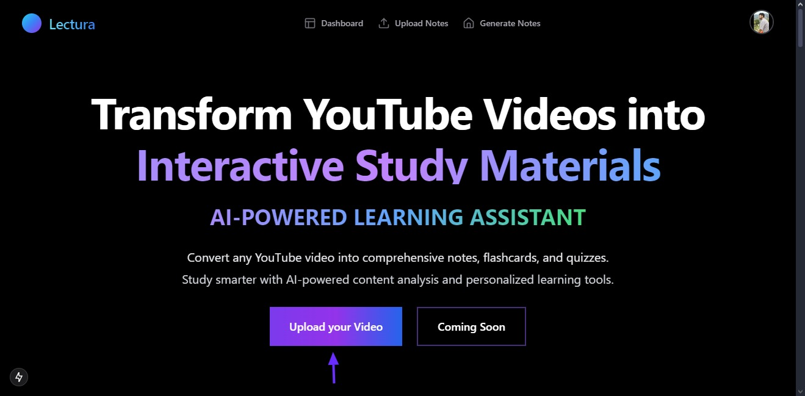
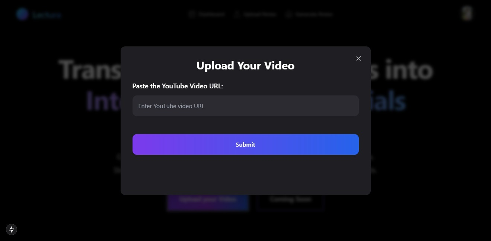
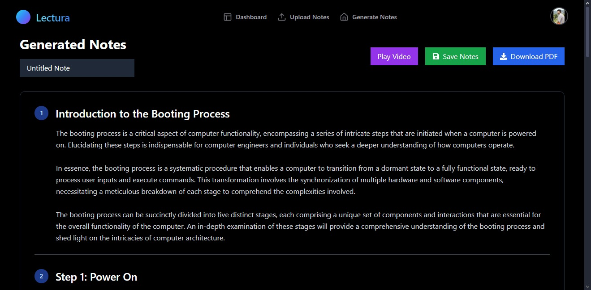
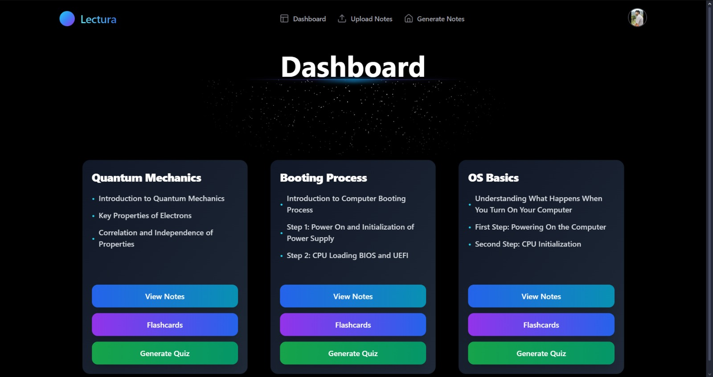
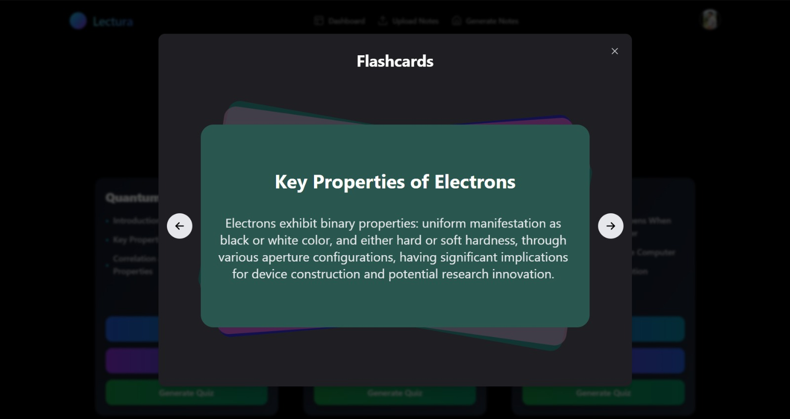
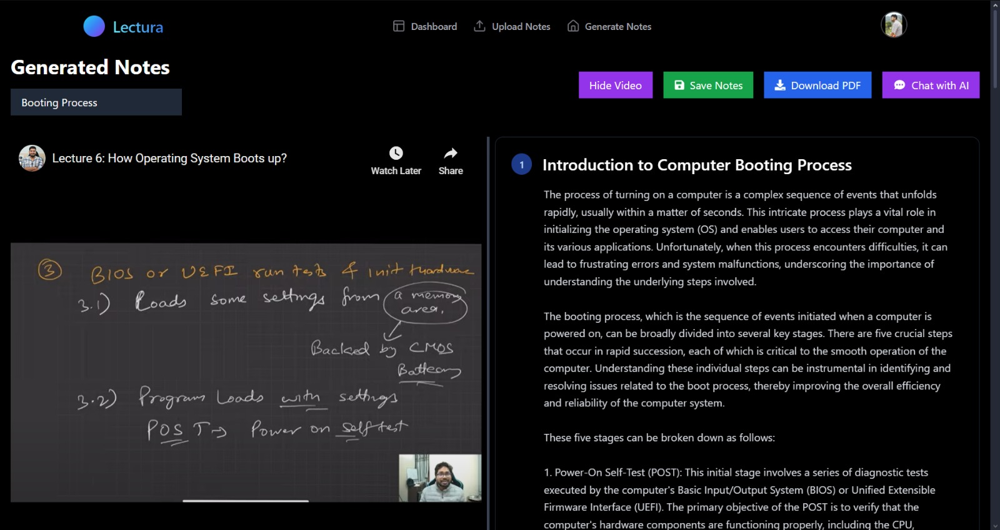
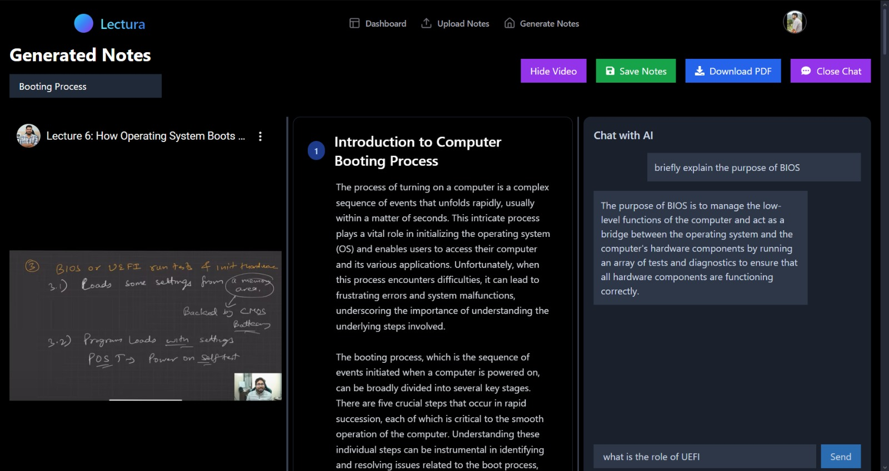
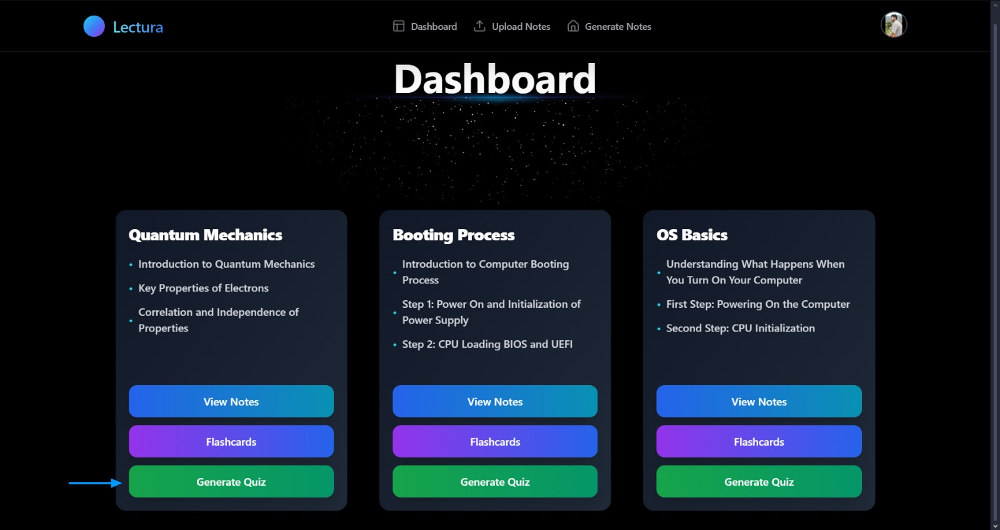
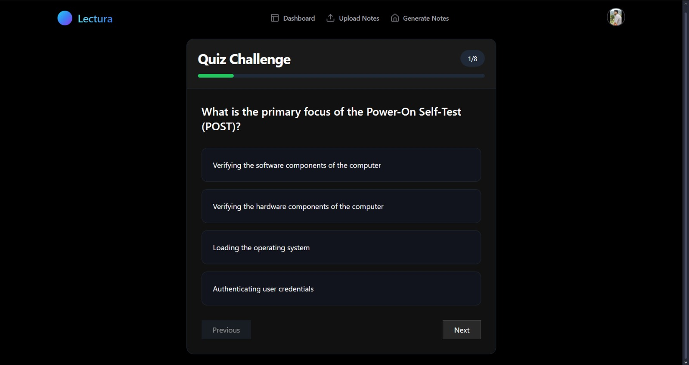
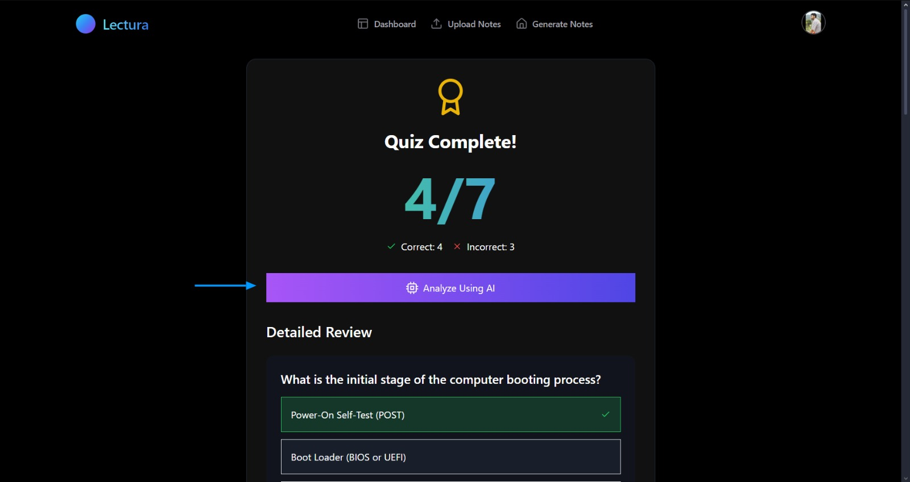
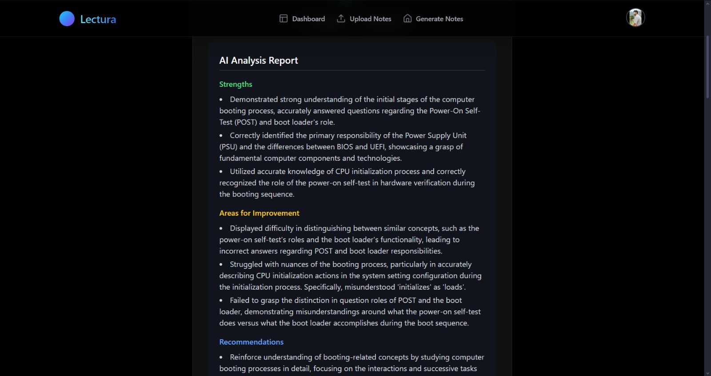

## 📽️ Demo & Deliverables

•⁠  ⁠*Demo Video Link:* [https://www.youtube.com/watch?v=eRe7w2I6CzE]  
•⁠  ⁠*Pitch Deck / PPT Link:* [https://docs.google.com/presentation/d/1hIWxk1hUs1sc4iW7C5nHWVCxpmqBoAZx8lyaTqUZpmc/edit?usp=sharing]

---

---

## 🧪 How to Run the Project
Either visit our live website at *[https://lectura-omega.vercel.app](https://lectura-omega.vercel.app)* or run the project locally by following the steps below:
### Requirements:
•⁠  ⁠Node.js  
•⁠  ⁠Next.js  
•⁠  ⁠Firebase account  
•⁠  ⁠Groq API account  
•⁠  ⁠Vercel/Render for deployment

### Local Setup:
```bash
#Clone the repo
git clone https://github.com/Mohit2005123/Lectura
cd Lectura

#Install frontend dependencies
npm install

#Navigate to the backend folder and install server dependencies
cd server
npm install

#Start the backend Node.js server for transcript extraction
node index.js

#Open a new terminal and return to the frontend folder
cd ..
npm run dev
```
## 🧬 Future Scope:

•⁠  ⁠📈 Integrate with major e-learning platforms (e.g., Coursera, Udemy) to broaden our reach.  
•⁠  ⁠🌐 Introduce voice-based input for hands-free note generation and enhanced interactivity.  
•⁠  ⁠🧠 Develop a personalized AI mentor that adapts to individual learning patterns for tailored guidance.  
•⁠  ⁠🛡️ Implement role-based access to create differentiated dashboards for teachers and students, fostering collaborative learning.

---

## 📎 Resources / Credits

•⁠  ⁠LLAMA model via Groq Cloud  
•⁠  ⁠Firebase (Google)  
•⁠  ⁠Vercel and Render for deployment  
  
---
